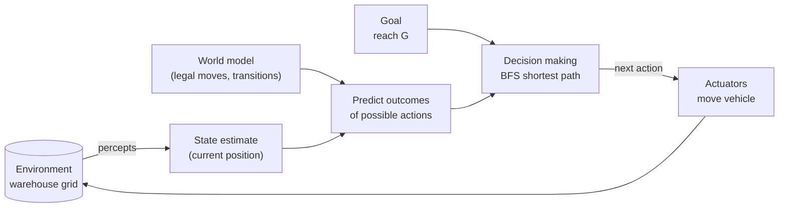

# Goal-Based Agent for Warehouse Navigation – Answers & Reflections


## Summary
A goal-based agent finds a collision-free path for a warehouse vehicle from `S` to `G` on a 7 × 21 grid using **Breadth-First Search (BFS)**. On the lab map it finds a **20-move shortest path**, and reports a clear message when no path exists.

```
#####################
#S***.#************G#
#.##****##########..#
#....##.............#
#.######.###.#.###..#
#........#..........#
#####################
```

## Task 1 – Understanding the Problem

1. **Environment:** A 7 × 21 grid-world of free cells (`.`) and obstacles (`#`). It is fully observable, deterministic, static, discrete and single-agent.
2. **Goal:** Reach cell `G` from `S` without entering an obstacle, using as few moves as possible.
3. **Actions:** Up, Down, Left, Right (one square each), legal only if the target cell is in bounds and not `#`.
4. **Information the agent must maintain:** its current position, the goal position (goal test), the map/transition model, and search bookkeeping: a frontier (queue), a visited set and parent links to reconstruct the path.
5. **Why goal-based, not simple reflex:** A simple reflex agent maps the current percept straight to an action via condition–action rules and has no destination, so it can loop or get stuck in dead ends. This agent has an explicit goal, a model of what its actions do, and searches through sequences of future actions to choose those that lead to `G`.

**Think About It – twice as large?**
BFS would still be correct (complete and optimal), and its cost grows with the number of reachable cells (about 4× if both dimensions double), so it would still be fast at this scale. In the notebook, expanded states grew roughly in proportion to map size (72 → 245 → 950 → 3720 for scale 1, 2, 4, 8). But BFS is uninformed and expands evenly in all directions, so for much larger maps A\* with a Manhattan-distance heuristic is usually better. Further difficulties: memory growth, partial observability (must re-plan), dynamic obstacles/other vehicles, non-uniform move costs (BFS assumes all cost 1), and multi-vehicle coordination.

## Task 2 – Agent Design

| Component | Design |
|---|---|
| Environment | Warehouse grid with shelves/walls |
| Current state | Vehicle position `(row, col)` |
| Goal | Position of `G` |
| Actions | Up, Down, Left, Right |
| Decision-making component | BFS search producing a sequence of actions |



## Task 3 – Prompt Engineering

**1. Did the LLM generate a working program on the first attempt?**
Yes. The generated program ran without errors and printed a valid path on the first attempt. I did not rely on this alone: I replayed the path on the map to confirm it never touches `#` and ends at `G`, compared its length (20) with an independent shortest-distance calculation, and tested edge cases (unreachable goal, adjacent start/goal, malformed map). All passed.

**2. If not, how can I improve the prompt?**
Not needed for a working result, but the prompt could be made better by:
- stating the exact map and its symbols inside the prompt;
- specifying the required structure (separate environment and agent classes, a goal test, a transition model);
- asking for an optimal (shortest) path explicitly, rather than any path;
- asking for test cases, including one with no solution;
- specifying the output format (list of moves and a drawn map).

If the first attempt had failed, I would paste the exact error message and the code back into the LLM and ask for a targeted fix.

**3. Which search algorithm did the LLM choose?**
Breadth-First Search (BFS).

**4. Why do you think the LLM selected it?**
Every move costs the same, so BFS guarantees the shortest path and is complete. It is also simple to implement (queue + visited set + parent pointers), and the grid is tiny so its memory use does not matter. It is the standard textbook answer for unweighted grid pathfinding, which is also likely to be heavily represented in the LLM's training data. It didn't need a heuristic, so A\* would add complexity without much benefit at this size.

## Reflection: Strengths and Limitations of LLM-Assisted Engineering

**Strengths**
- Fast at producing well-structured, documented code from a clear specification.
- Good at explaining design choices (why BFS) and generating test ideas.
- Iterating by prompting is quick: errors can be pasted back for fixes.

**Limitations**
- Output looking plausible and running once is not proof of correctness. It has to be checked independently (path replay, optimality check, edge cases).
- Quality depends on how precise the prompt is; vague specs give generic or under-tested code.
- An LLM may pick a "textbook default" without considering alternatives, and may hedge or overstate claims (for example about which algorithm scales better) unless they are measured.
- The human still needs to understand the agent design, otherwise the results can't be evaluated critically.

